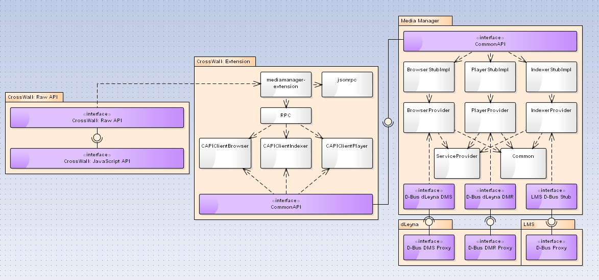

TODO
----
* Add the correct paths to clone each repository
* Add more tutorial sections for the extension

Overview
--------
This is the documentation for the core component of the Media Manager project.
The Media Manager is not usable using only this component, but also requires
the Media Manager CrossWalk extension, LMS, dLeyna and Rygel.

The intention of this document is that it can be used as the starting place for
reading about the Media Manager, and will direct to further reading about the
other required software, such as the CrossWalk extension.

For documentation on the extension, and also documentation on how to use the JavaScript API used in the extension, please refer to the documentation of the `media-manager-extension` project. It can be found in the GENIVI git: http://git.projects.genivi.org/media-manager-extension.git

What is the Media Manager project?
----------------------------------
The purpose of the Media Manager project is to provide a way to browse and play music in an IVI system. Use-cases and management-related documentation on the project can be found on here: http://wiki.projects.genivi.org/index.php/Media_Manager. In general, the project is divided in to three areas; playback, browsing and indexing. For all these areas, the project relies on third-party software, and in some cases the functionality of this software is augmented by the Media Manager. The third party components used are the following:
* For playback, the Rygel DMR is used. This will in turn use GStreamer for playback. In order to fulfill all requirements, some functionality is added via the PlayerProvider component in Media Manager.
* For browsing, the Rygel DMS is used. The Media Manager specific browsing logic (directory structure, etc) is implemented in a plug-in for Rygel, called the Rygel LMS plugin.
* For indexing, LMS is used. LMS has been modified to include support for media art indexing.

In addition to this, dLeyna is a core component in the project, and is used to communicate with the Rygel DLNA server. dLeyna has been extended to support Artist and AlbumArtURL properties on containers.

Building
--------
Several additions to LMS, Rygel and dLeyna are required by the Media Manager project. The additions to LMS are not suitable for upstream, and the additions to dLeyna and Rygel have not (as of this writing) been accepted in upstream. This means you need to use Media Manager specific clones of these three projects to proceed. This section gives build instructions and buildint tips for Tizen. Media Manager also builds on Debian, and the build instructions are similar (minus the use of GBS).

The following steps assume that the getting started guide has been followed in order to be able to build a Tizen image. Th guide can be found here: https://source.tizen.org/documentation/articles/creating-tizen-ivi-images-scratch-one-page. The Tizen source directory is assumed to be in ~/tizen.

Build and install D-Bus with the GENIVI patch for CommonAPI support

    cd dbus-1.4.6
    gbs -c ~/tizen/.gbs.conf build -A i586 --include-all

Build and install CommonAPI

    cd common-api-runtime
    gbs -c ~/tizen/.gbs.conf build -A i586 --include-all

Jansson is already packaged for Tizen IVI, but does not appear to be
included in the repos list yet. It can be be found in:
https://review.tizen.org/gerrit/gitweb?p=profile%2Fivi%2Fjansson.git;a=summary

Clone the repository indicated in the gitweb instance of the above URL (you will need a Tizen Review account), and issue the following:

    git remote rm upstream
    git branch -D upstream

    # The git commands are to convince GBS to use the local sources for building.

    gbs -c ~/tizen/.gbs.conf build -A i586

Build and install the Media Manager

    git clone http://git.projects.genivi.org/media-manager.git
    cd media-manager

The media-manager-extensions repository can not be cloned from within gbs,
there seems to be a problem with network connectivity. Also, GBS strips the
source directory from its .git-directory, so submodule information is lost. To
mitigate this, we will create a tarball of the interfaces submodule, and have
the build system unpack this rather than clone it. The spec file contains
command sto uncompress "interfaces.tar.gz" - so ensure this is the name of the
archive.

    git submodule init
    git submodule update
    # (or just check out the latest commit in the interfaces/ directory)

    tar cvfz interfaces.tar.gz interfaces

    gbs -c ~/tizen/.gbs.conf build -A i586 --include-all

Build and install the Media Manager CrossWalk extension

    git clone http://git.projects.genivi.org/media-manager-extension.git
    cd media-manager-extension

Again, we need to compress the interfaces to interfaces.tar.gz.

    git submodule init
    git submodule update

    tar cvfz interfaces.tar.gz interfaces

    gbs -c ~/tizen/.gbs.conf build -A i586 --include-all

Build and install patched Rygel 2.2

    cd ~/tizen/profile/ivi/rygel
    git checkout accepted/tizen/ivi/20140515.155406
    git remote add pelagicore https://github.com/Pelagicore/Media-Manager-Rygel-patched.git
    git cherry-pick 4d0de99458b3feed614ae7641c58f721f3504261

    gbs -c ~/tizen/.gbs.conf build -A i586 --include-all

Build and install Rygel LMS plugin

    git clone https://github.com/Pelagicore/Media-Manager-Rygel-LMS-Plugin.git
    cd Media-Manager-Rygel-LMS-Plugin
    gbs -c ~/tizen/.gbs.conf build -A i586 --include-all

Build and install dLeyna renderer

There's a bug in dleyna-renderer when setting playback rate. This has been
fixed in upstream, but does not appear to be in Tizen yet. We need to re-build
dleyna-renderer with the fix applied. You should first check if your dLeyna
distribution includes b29a006a6fa397fadad6e331e12c17170ff0115b, if it does,
this step can be omitted. The patch from the Pelagicore repository is not
necessary, but can be applied if you're patching anyway. It will add extra
playback speeds.

    cd ~/tizen/profile/ivi/dleyna-renderer
    
    git remote add intel_github https://github.com/01org/dleyna-renderer.git
    git fetch intel_github
    git cherry-pick b29a006a6fa397fadad6e331e12c17170ff0115b
    
    git remote add pelagicore https://github.com/Pelagicore/Media-Manager-dLeyna-patched.git
    git cherry-pick 2927f62cb685b160d624a474d97ae2dde004ba56
    
    gbs -c ~/tizen/.gbs.conf build -A i586 --include-all

Build and install lightmediascannerd

    git clone https://github.com/Pelagicore/Media-Manager-lightmediascanner-patched.git
    cd Media-Manager-lightmediascanner-patched
    gbs -c ~/tizen/.gbs.conf build -A i586 --include-all

Tips
----
Tizen IVI does not (at the time of this writing) ship with MP3 support. This can be fixed by installing libmad and enabling mad support in gst-plugins-ugly. libmad, with a corresponding RPM spec file can be found in distributions (such as SuSE) shipping libmad.

Here is a patch for gst-plugins-ugly.spec for enabling libmad:

    diff --git a/packaging/gst-plugins-ugly.spec b/packaging/gst-plugins-ugly.spec
    index 0cb3b28..19b64e6 100644
    --- a/packaging/gst-plugins-ugly.spec
    +++ b/packaging/gst-plugins-ugly.spec
    @@ -14,6 +14,8 @@ BuildRequires:  pkgconfig(gstreamer-1.0)
     BuildRequires:  pkgconfig(glib-2.0)
     BuildRequires:  pkgconfig(opencore-amrnb)
     BuildRequires:  pkgconfig(opencore-amrwb)
    +BuildRequires: libmad0

     %description
      GStreamer is a streaming media framework, based on graphs of filters
    @@ -50,7 +52,6 @@ NOCONFIGURE=1 ./autogen.sh
      --disable-cdio\
      --disable-dvdread\
      --disable-dvdnav\
    - --disable-mad\
      --disable-mpeg2dec\
      --disable-sidplay\
      --disable-twolame\
    @@ -72,5 +73,6 @@ make %{?jobs:-j%jobs}
     %{_libdir}/gstreamer-1.0/libgstamrnb.so
     %{_libdir}/gstreamer-1.0/libgstamrwbdec.so
     %{_libdir}/gstreamer-1.0/libgstrmdemux.so
    +%{_libdir}/gstreamer-1.0/libgstmad.so
     %exclude %{_datadir}/gstreamer-1.0/presets/GstAmrnbEnc.prs

Architecture
------------
This section discusses the internal architecture of the Media Manager core component. The following conventions are used in the diagram:

* The four big boxes represent different subsystems
* The purple boxes represent interfaces between components or Systems. This some form of IPC, such as D-BUS, or some communications protocol between two components, such as JSON-RPC.
* The Assembly icon (point to the ball and socket figure) indicates communication between interfaces.
* The dashed arrow indicates a dependency

The diagram shows several subsystems, but this documentation only concerns the rightmost subsystem (the Media Manager core component). The entire system is shown to give some context and to allow the reader to see where the different subsystems connect.

The BrowserStubImpl, PlayerStubImpl and IndexerStubImpl modules provide a conversion layer between the CommonAPI domain and the Media manager domain, converting CommonAPI data types to internal data types, etc.

The Provider layer augments the functionality of dLeyna and LMS to fill in gaps in the requirements and to adapt functionality in dLeyna and LMS which doesn't follow the Media Manager use cases and specifications. An example is that Stop is treated as a Pause in the Media Manager. In dLeyna a Stop will clear any current buffers in GStreamer and reset any playback state, which is not desired in the Media Manager.

A different example is that the Media Manager should handle the current play queue, while dLeyna and Rygel are not designed for this, will offload the playlist functionality to the controlling component. The Media Manager thus adds playlist capabilities (plus some additional functionality to the MPRIS2 API) and hides this behind the same API as the rest of the functionality, so that this addition is seamless to the user.

The ServiceProvider contains some common D-Bus code for all Providers, and the Common module contains some common helper code.

The remaining six interfaces represent the D-Bus interfaces of dLeyna and LMS.

